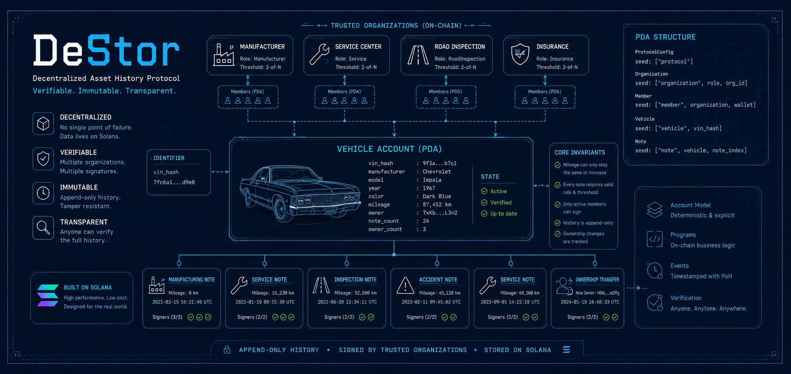

# DeStor

# About
DeStor (Decentralized Storage) - is a decentralized protocol for building immutable history registries for real-world assets.

The vehicle registry is the first demonstration of the protocol.

## Why Solana?
DeStor is built on Solana because its account-based architecture fits naturally with the protocol data model.

Each real-world asset can be represented by a dedicated program account, while its history is stored as separate append-only event accounts. Organizations, members, permissions, and confirmation state can also be represented explicitly through program-derived accounts.

Solana was selected for several reasons:

- **Account-based data model.**
Vehicles, organizations, members, and history records can be represented as separate on-chain accounts with clear relationships and permissions.
- **Fast transaction processing.**
New records and confirmations can be submitted without long settlement delays, which is important for a system used by multiple organizations.
- **Low transaction costs.**
A vehicle may accumulate many records during its lifetime. Low fees make frequent updates more practical.
- **Public verification.**
Any user can read protocol accounts and independently verify the history of an asset without relying on a private database.
- **Deterministic authorization.**
Program rules can enforce which organizations and members are allowed to create or confirm specific record types.
- **Ordered and timestamped history.**
Solana provides an ordered ledger of transactions. Each protocol record stores the Solana Clock timestamp, making it possible to verify when the record was submitted and how it relates to earlier records.
- **Composable ecosystem.**
The protocol can later integrate with wallets, NFT standards, decentralized storage systems, indexers, and other Solana programs.

Proof of History contributes to the ordering of transactions within the Solana network. DeStor does not treat it as proof that a real-world event happened at a specific moment. Instead, the protocol proves when a record was submitted on-chain, who submitted it, and which trusted participants confirmed it.

## The core idea in vehicle market case
A vehicle has a public digital passport, and trusted actors append signed history records about mileage, repairs, inspections, incidents, insurance reports, and ownership changes.

The protocol does not prove that an event happened in the real world.

Instead, it provides an immutable record of:
- who submitted the event
- who confirmed it
- when it happened
- whether protocol trust requirements were satisfied

## What problem does the project solve?
Second-hand markets often lack a reliable and tamper-resistant history of an asset.

Important information such as mileage, repairs, inspections, accidents, and ownership changes may be incomplete, altered, or intentionally hidden from a buyer.

DeStor addresses this problem by creating a public, append-only history of an asset, where every record includes its author, timestamp, organization, and confirmation status.

The vehicle market is the first use case, but the same model can be applied to other real-world assets, including real estate, industrial equipment, machinery, luxury goods, and collectibles.

## Goals
- Make mileage rollback visible or impossible inside the protocol.
- Make vehicle history public and easy to verify by VIN.
- Show who added each record and which organization confirmed it.
- Require multiple trusted signatures for sensitive records.
- Keep the MVP simple enough to build, explain, and demo.

## Documentation

- [Architecture](./ARCHITECTURE.md)
- [Security Model](./SECURITY.md)
- [Roadmap](./ROADMAP.md)